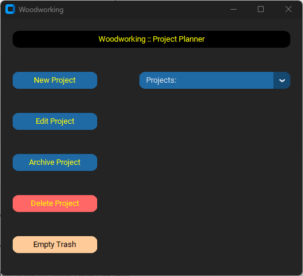
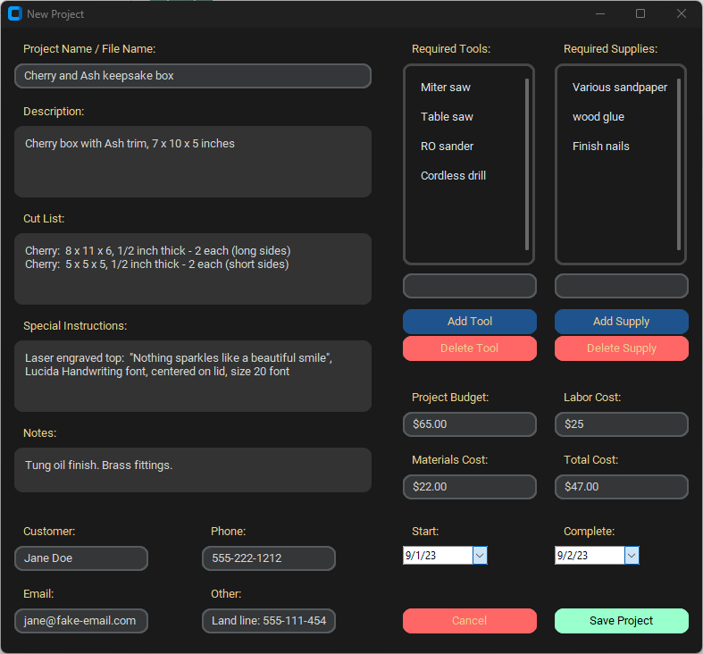

  # Woodworking :: Project Manager  
  A simple GUI app for keeping track of woodworking projects.  
  
  ## Get Started  
  Clone, fork, or download the code. From a command line or terminal inside the folder that contains the code, type this and press enter:  python3 main.py  
  
  ## Features
      
  #### Easy to use
   - Simple interface
   - No confusing menus or commands to remember
   - Always open source, always free
   - Editing projects is a piece of cake
   - Easily archive or delete projects
   - Built-in "recycle bin"
   - Uses JSON for easy compatibility
   - App window position is saved and reused

  #### Cross-platform 
   Use the software on:
   - Linux
   - macOS
   - Windows

  ## To Do
   - Add links to project imagges or folder

  ## License
  - MIT license

  ## Screen shots
  
  
  
   - This screenshot is outdated, but shows the basic functionality
